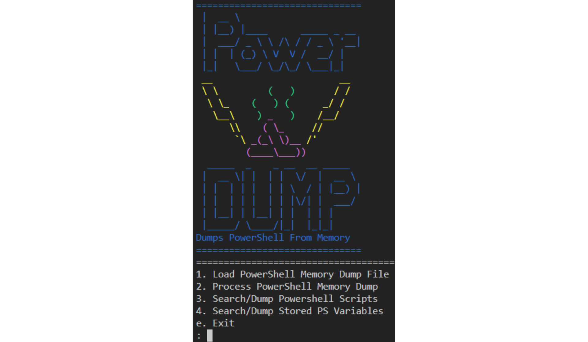

# Power Dump 

Power Dump takes a 64 bit Windows 10 powershell process dump made using procdump and retrieves powershell blocks and variables from memory. Basically its strings on steroids with a little extra logic built-in for finding powershell. Only tested and built out right now for/on Windows 10 64 bit Intel.

# Pre Reqs:

Download procdump from sysinternals:

https://docs.microsoft.com/en-us/sysinternals/downloads/procdump

# Usage:

1. `git clone https://github.com/chrisjd20/power_dump.git`
2. Have a powershell scrip running. Take its process ID and run the following:
    - `procdump64.exe -ma <pid>`
3. `py -2 power_dump.py`      <-- Windows (if Py2 and py3 are installed)
3. `python power_dump.py`     <-- Linux
4. Select option 1
5. `ld powershell.exe_mem_dump1928461283`
6. Select option 2  (wait for it to process)
7. Select option 3 or 4 to perform filter searching

# License: MIT License

# Test on: Windows 10 64 bit Intel

# Todo:

Needs some cleaning up. Expand this out for all Windows OS dumps and architectures. Also add different payload searches other than powershell.
